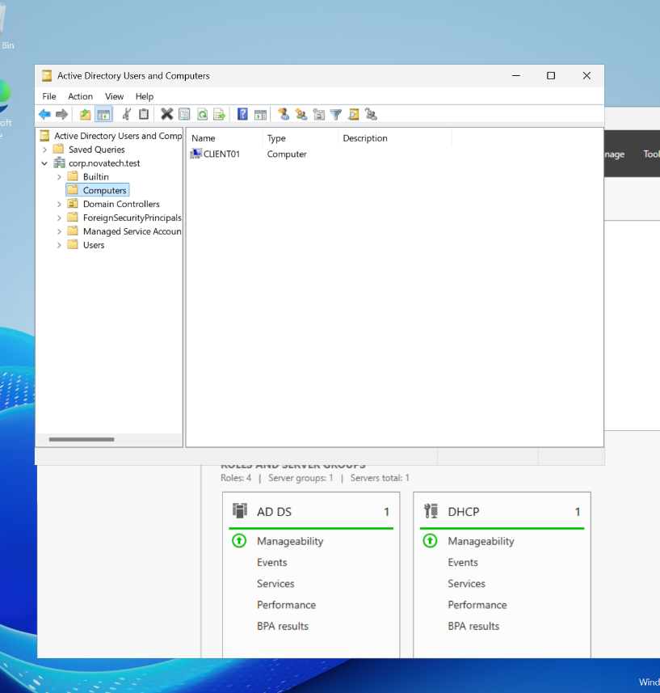
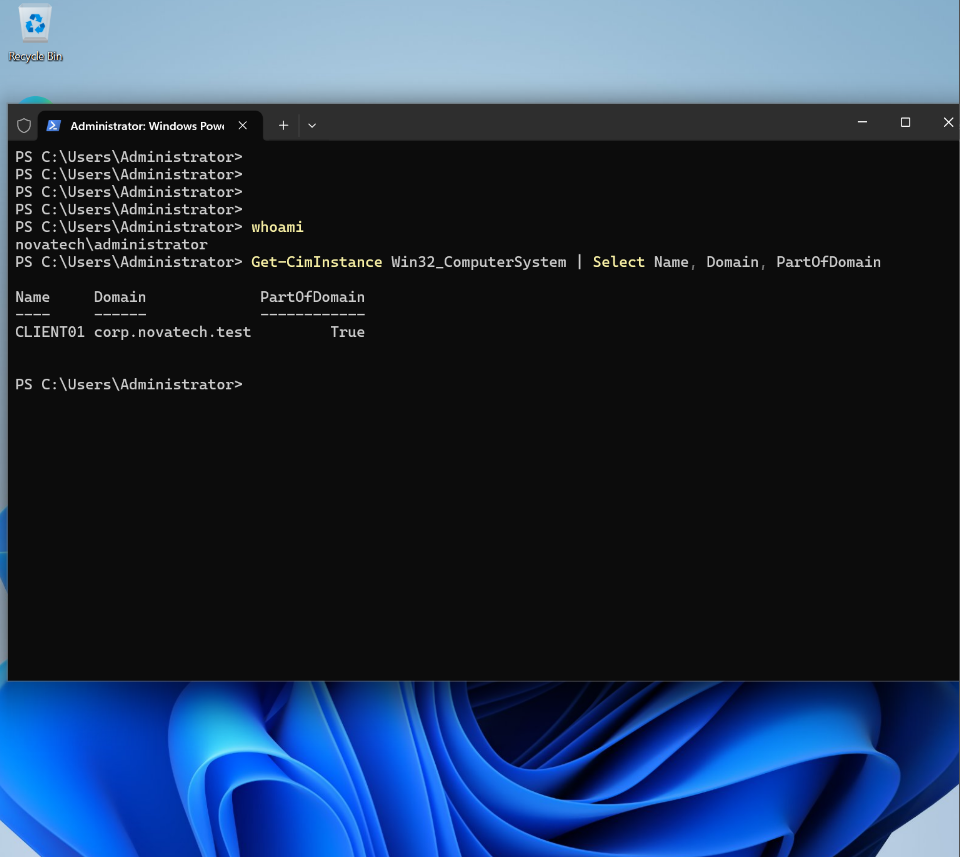
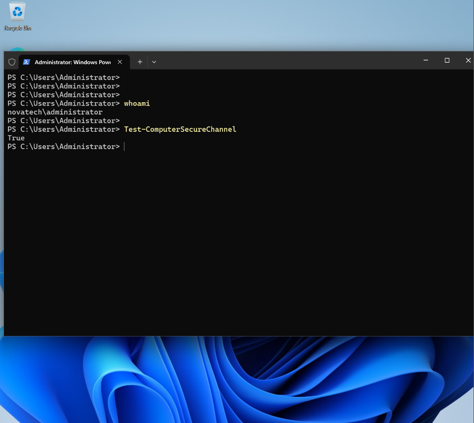

# Windows 11 Domain Join — NovaTech Lab

## Objective

Join a Windows 11 workstation (CLIENT01) to the `corp.novatech.test` Active Directory domain and verify domain membership and computer account registration.

## Environment

| Component | Configuration |
|---|---|
| Domain Controller | DC01 |
| Server OS | Windows Server 2025 |
| Client | CLIENT01 — Windows 11 |
| AD Domain | `corp.novatech.test` |
| Domain Controller IP | `192.168.10.10` |
| Client Network | `192.168.10.0/24` |
| DNS Server | `192.168.10.10` |
| Virtualization | Oracle VirtualBox |

## Prerequisites

- Active Directory Domain Services installed and DC01 promoted as a domain controller.
- DNS configured with the required AD records.
- DHCP operational and client receiving an address on the NovaTech internal network.
- Network connectivity between CLIENT01 and DC01.
- Credentials authorized to join computers to the domain.

## Implementation

### 1. Verify connectivity and DNS

On CLIENT01:

```powershell
ping 192.168.10.10
Resolve-DnsName DC01.corp.novatech.test -Server 192.168.10.10
Resolve-DnsName _ldap._tcp.dc._msdcs.corp.novatech.test -Type SRV -Server 192.168.10.10
```

### 2. Join the domain

Run PowerShell as Administrator on CLIENT01:

```powershell
Add-Computer -DomainName "corp.novatech.test" -Credential "NOVATECH\Administrator" -Restart
```

The workstation authenticates against the domain, registers a computer account and restarts.

### 3. Verify domain membership

On CLIENT01:

```powershell
whoami
Get-CimInstance Win32_ComputerSystem | Select-Object Name,Domain,PartOfDomain
Test-ComputerSecureChannel
```

Confirmed:

- Domain account: `novatech\administrator`
- Computer: `CLIENT01`
- Domain: `corp.novatech.test`
- Domain membership: `True`

### 4. Verify computer registration

On DC01:

```powershell
Get-ADComputer CLIENT01 -Properties DNSHostName,Enabled |
    Select-Object Name,DNSHostName,Enabled,DistinguishedName
```

Confirmed:

- Computer account: `CLIENT01`
- DNS hostname: `CLIENT01.corp.novatech.test`
- Account enabled: `True`
- AD location: `CN=Computers,DC=corp,DC=novatech,DC=test`

## Evidence

### Client domain membership



### Computer account in Active Directory



### Secure channel



## Outcome

CLIENT01 successfully joined the NovaTech Active Directory domain. Domain authentication and computer registration were verified.

The workstation is ready for organizational unit placement, domain user management and Group Policy testing.
